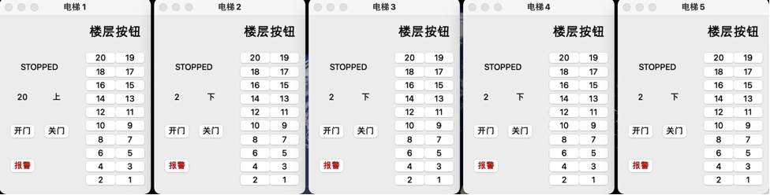

# OS_Elevator_Stimulater

Tongji SSE OS course project

[TOC]

## 项目背景分析

项目需要实现对一个电梯系统的模拟，用来对比处理机调度中的进程调度问题。每一个需要乘坐电梯的乘客在楼层按下电梯的按钮相当于一个创建了一个请求电梯的“进程”；而五部运转的电梯相当于“处理机”，用来处理乘客的请求；同时进入电梯内部的乘客按下需要到达的楼层，也相当于进程任务的一部分。

### 进程调度类比

在实际的处理机调度中有FCFS (First-Come, First-Served )先到先行调度、SJF (Shortest-Job-First )最短作业优先调度、Priority Scheduling优先级调度、RR (Round Robin )轮转法调度、Multilevel Queue多级优先级调度。下面进行这些算法参与实际的电梯调度可行性的分析

首先是FCFS先来先服务算法：顾名思义，即先按下楼层按钮申请电梯资源的人就可以优先获得电梯。显然，这种算法对与电梯负载较小时具有很好的用户体验，每个人都具有较少的等待时间；但是当人流量增大时，较远楼层的请求会极大的影响电梯整体的效率。

SJF算法，即让距离电梯最近的人最优先获得电梯。显然这种方法可以显著降低平均等待时间，但少数远距离楼层可能长时间得不到电梯，不能符合实际情况

Priority Scheduling,显然实际情况中没有优先级这种情况。RR算法，实际中不可能让电梯将乘客暂时放出电梯外。Multilevel Queue算法，和Priority Scheduling类似，没有优先级的概念。

### 实际电梯调度算法

现阶段比较成熟的电梯调度算法有：**扫描算法（SCAN**）,**LOOK算法**，**SCAN-EDF算法**，**PI算法**等等。

扫描算法（SCAN），是一种按照楼层顺序依次进行服务请求的算法，电梯在最底层和最顶层之间往返，运行过程中响应相同方向上楼层的请求。这种算法效率比较高，解决了电梯移动的问题，在算法中，电梯响应乘客请求使乘客获得服务的次序是由其发出请求的乘客位置与当前电梯位置之间的距离来决定的。

LOOK算法，是扫描算法的一种改进，电梯同样在最底层和最顶层之间运行，但当发现电梯所移动的方向上不在有请求时改变方向，进一步提高了效率。

SCAN-EDF算法，是SCAN算法和EDF算法相结合的产物，是一种实时的算法。算法按照EDF算法选择请求队列中哪个是下一个服务对象，而对于具有相同时限的请求，则按照SCAN算法服务每一个请求。

PI算法，算法将请求队列中的请求优先级分成两个优先级，首先保证高优先级队列中的请求得到及时的响应，其次再满足低优先级队列中的请求。

## 开发/运行环境

Qt版本：Qt5.9.8

Qt Creator版本：macOS/4.8  Win10/4.8.2

编译器：macOS/Clang   Win10/MinGW 5.3.0 32bit

## 整体架构

### 架构模式

项目整体采用MVC架构模式。

结构体ele_model是电梯的实际model，继承类elevator，作为model和view通信的viewControler(控制器)

buildingoffloor继承类作为model和viewControler的复合结构，表示楼层上的电梯请求。

mainwindow类一方面作为电梯主界面的控制器，一方面实现ele_model和buildingoffloor的通信。

dispatch是实现将楼层上的电梯请求分配给各电梯的函数。

### 实现模式图


## 类设计

### elevator类

```c++
1.	enum ele_state
2.	{
3.	    STOPPED,
4.	    MOVING,
5.	    OPENING,
6.	    CLOSING,
7.	    BROKEN
8.	};
9.	
10.	const QString state_name[5]
11.	{
12.	    "STOPPED",
13.	    "MOVING",
14.	    "OPENING",
15.	    "CLOSING",
16.	    "BROKEN"
17.	};
18.	
19.	//电梯的结构体
20.	typedef struct ele
21.	{
22.	    //int ele_num;//电梯号
23.	    int current_floor;//电梯当前层数
24.	    int direction;//电梯方向 -1 0 1 共三种状态
25.	    bool isAlarming;//判断是否有人报警
26.	    bool request[21];//楼层请求//外部请求也显示在上
27.	    ele_state state;//电梯运动状态
28.	} ele_model;
```

模型中电梯有5种状态：*STOPPED  MOVING OPENING CLOSING BROKEN*

每个模型包含有：current_floor(当前楼层)，direction(方向)，isAlarming(判断报警)，request[21] (请求队列)这些属性

```c++
1.	class elevator : public QWidget
2.	{
3.	    Q_OBJECT
4.	public:
5.	    explicit elevator(QWidget *parent = nullptr);
6.	    ~elevator();
7.	    ele_model ele_model_inside;//电梯模型
8.	private slots:
9.	    void on_floor_button_clicked();
10.	    //内部run
11.	    void run();
12.	    //更新view
13.	    void update_view();
14.	    void on_alarm_btn_clicked();
15.	private:
16.	    void stop();
17.	    //延时函数
18.	    void sleep(int msec);
19.	    //按钮
20.	    QPushButton *btn[21];
21.	    QPushButton *open_btn, *close_btn, *alarm_btn;
22.	    //标签
23.	    QLabel *lbl_direct, *lbl_floor, *lal_state;
24.	    int make_only_one_run;
25.	    Ui::elevator_UI *ui;
26.	};
```

类中的成员槽函数run()用来进行电梯状态之间的转换。

```c++
1.	void elevator::run() {
2.	    //控制只能有一个run函数在运行 类似于PV操作
3.	    if(make_only_one_run != 0)
4.	        return;
5.	    make_only_one_run = 1;
6.	
7.	    int sum_request = 0;//计算请求总量
8.	    for(int i = 1; i <= 20; i++)  {
9.	        sum_request += ele_model_inside.request[i];
10.	    }
11.	    //请求总量为零 停止并退出运行
12.	    if(sum_request == 0)  {
13.	        stop();
14.	        make_only_one_run = 0;
15.	        return;
16.	    }
17.	
18.	    //根据电梯的状态运行
19.	    //TODO:
20.	    switch (ele_model_inside.state) {
21.	    case STOPPED:  {
22.	        //切换成运动态
23.	        ...
24.	    }
25.	        break;
26.	    case MOVING:  {
27.	        //如果当前楼层有请求
28.	        if(ele_model_inside.request[ele_model_inside.current_floor] == true)
29.	        {...}
30.	        else//没有请求{
31.	            //方向反转
32.	            //计算上下请求的数目
33.	           ...
34.	            sleep(1000);
35.	            ele_model_inside.current_floor += ele_model_inside.direction;
36.	        }
37.	    }
38.	        break;
39.	    case OPENING:  {
40.	        sleep(3000);
41.	        ele_model_inside.state = CLOSING;
42.	    }
43.	        break;
44.	    case CLOSING:  {
45.	        sleep(3000);
46.	        ele_model_inside.request[ele_model_inside.current_floor] = false;
47.	        ele_model_inside.state = MOVING;
48.	    }
49.	        break;
50.	    case BROKEN:
51.	    {...}
52.	        break;
53.	    }
54.	    make_only_one_run = 0;
55.	    return;
56.	}
```

通过类成员变量控制只有一个run()函数的运行

```c++
1.	//控制只能有一个run函数在运行 类似于PV操作
2.	    if(make_only_one_run != 0)
3.	        return;
4.	    make_only_one_run = 1;
```

电梯的时间控制：电梯1s上升一层，从运动态转到开门态需要2s，开门和关门时间各需要3s

报警机制：电梯报警后停止运行，并且将对应界面变为红色。

### Buildingoffloor类

主要储存楼层上按下电梯上下按钮的请求，以及请求发生的顺序。

```c++
1.	//电梯请求信息
2.	bool request_up[20];
3.	bool request_down[21];
4.	std::queue<int> request_queue_up;//队列 记录按钮的请求顺序
5.	std::queue<int> request_queue_down;
```

### MainWindow类

```c++
1.	class MainWindow : public QMainWindow
2.	{
3.	    Q_OBJECT
4.	public:
5.	    explicit MainWindow(QWidget *parent = nullptr);
6.	    ~MainWindow();
7.	    std::vector<elevator*> elevators;//电梯的collection
8.	    buildingOfFloor *building;//楼层模型
9.	private slots:
10.	    void update_view();
11.	    //同步ele和building的model
12.	    void synchronize_ele_building();
13.	private:
14.	    unsigned int request_tol;//楼层的电梯请求总数
15.	    QSlider *ele_slider[5];//滑块电梯collocation
16.	    QLabel *num_floor[5];//电梯的层数显示
17.	    int make_only_one_synchronize;
18.	    Ui::MainWindow *ui;
19.	};
```

`std::vector<elevator*> elevators`：存储电梯

`buildingOfFloor *building`：存储楼层

`make_only_one_synchronize`：控制同步函数调用个数

`unsigned int request_tol`：电梯请求总数

### 调度算法设计

```c++
1.	void dispatch_to_elevator(std::vector<elevator*> &elevators, buildingOfFloor *building)
2.	{
3.	    //上行分配
4.	    if(building->request_queue_up.empty() == false){
5.	        int tar_up_num = building->request_queue_up.front();//楼层请求的层数
6.	        //判断tar_up_num的有效性 （可能请求被其他路过电梯执行
7.	        if(building->request_up[tar_up_num] == true){
8.	            int min_time = 2000;//初始化为一个较大的值
9.	            unsigned int ele_num = 0;//分派任务的电梯号
10.	            for(unsigned int i = 0; i < elevators.size(); i++){
11.	                if(cal_time(tar_up_num, elevators[i]) < min_time){
12.	                    min_time = cal_time(tar_up_num, elevators[i]);
13.	                    ele_num = i;
14.	                }
15.	            }
16.	            //委派任务
17.	            elevators[ele_num]->ele_model_inside.request[tar_up_num] = true;
18.	            //委派后删除请求
19.	            building->request_queue_up.pop();
20.	        }
21.	        else{
22.	            building->request_queue_up.pop();
23.	        }
24.	    }
25.	    if(building->request_queue_down.empty() == false)
26.	    { }
27.	}
```

基本的思想是先计算5部电梯到最早请求楼层的预估时间，将任务分配到预估时间最短的电梯上，直接体现为电梯中的按钮被按下，这样在电梯中的人也可以知道将要停止的楼层，方便乘客知晓电梯的运行

有于预估的时间是非实时的，所以在实际运行过程中，可能会出现：“如果调用另一台电梯，可能会更短的到达请求楼层”的情况，但是采用非实时的算法可以减少电梯的总的运行时间，效率也还是比较可观的。

计算预估到达时间的函数：

`int cal_time(int target_floor, elevator *ele)`

根据固定的模式时间计算，与实际情况不同。

## 实际运行图


### 调度功能测试

#### 基础测试

初始状态时，第1层或大于1层的乘坐请求。

<center class="half">

</center>

均为第一个电梯接受请求，反向状态也相同


第一部电梯在高楼层时，来自中间楼层的请求，距离第一部电梯近和距离其他电梯较近的情况：

<center class="half">

</center>

为第一部电梯和第二部电梯接受请求


LOOK算法实现检测：电梯先接受低楼层请求，再接受高楼层请求

<center class="half">

</center>

电梯走到最低有请求的楼层后即向上运行

#### 多请求测试

所有楼层上行请求：


所有电梯均接受请求，无异常发生


复合测试：电梯内部请求和全外部请求发生




请求全部接受并且完成全部请求